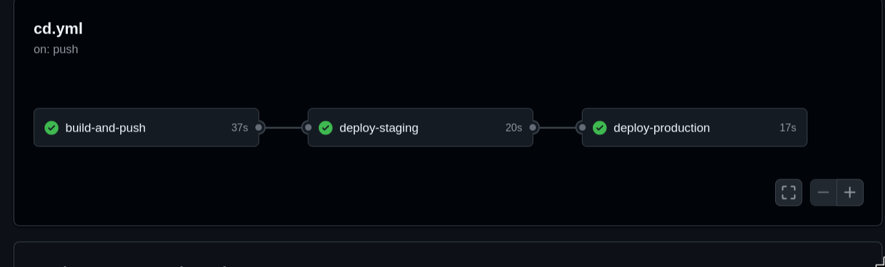
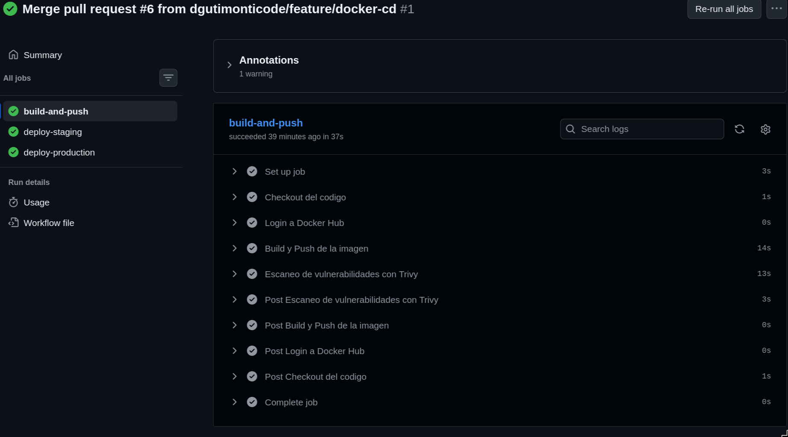
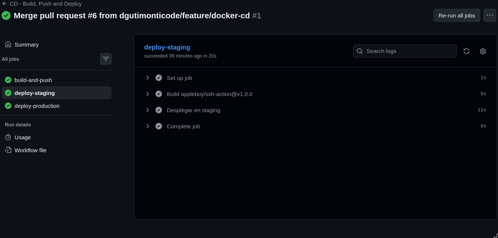
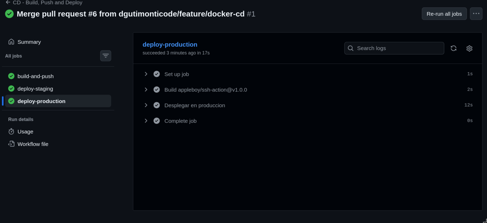
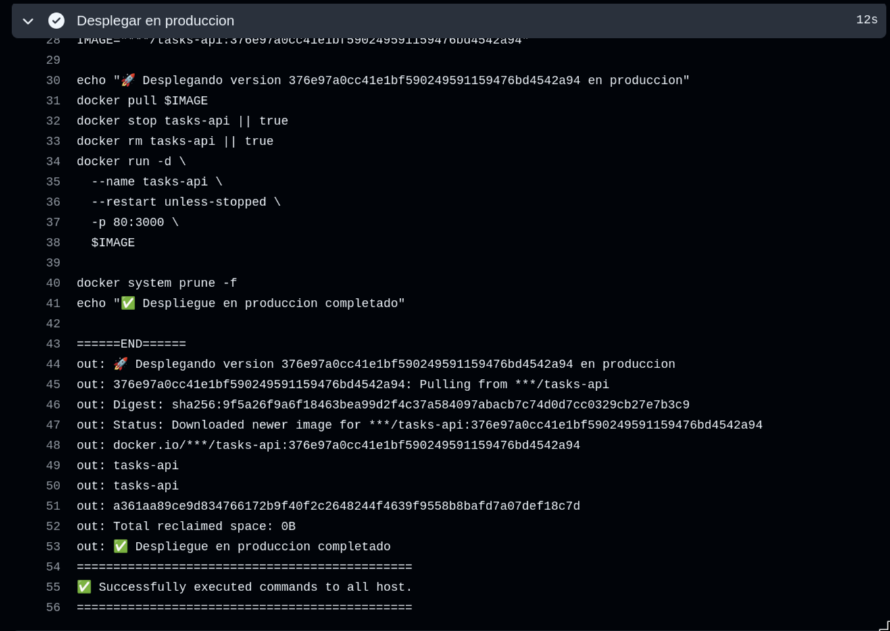
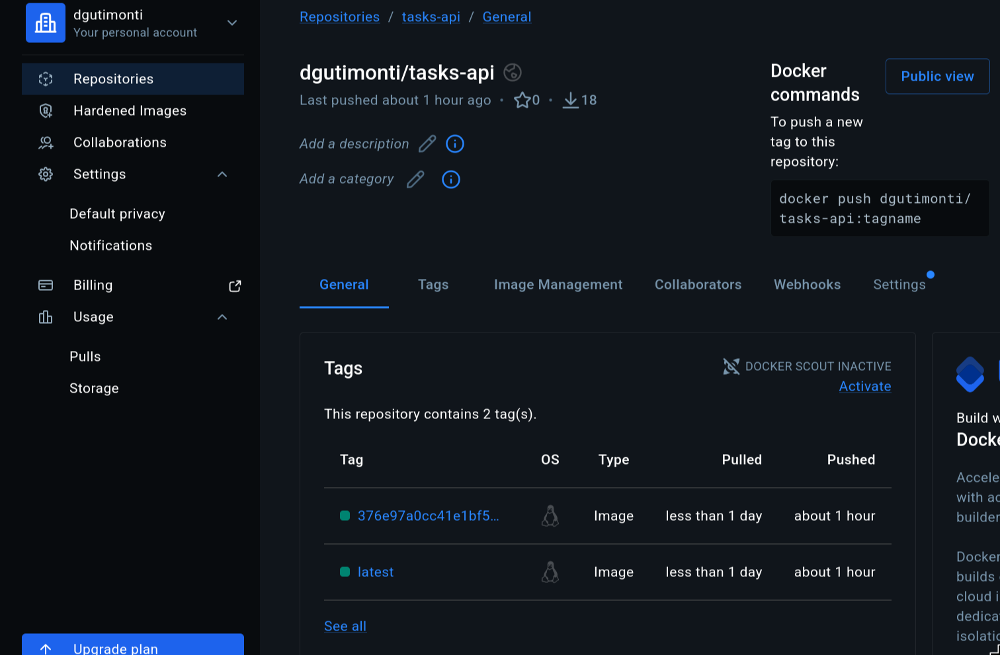
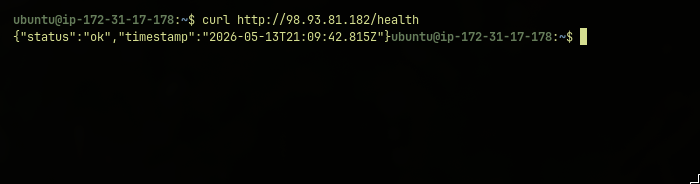
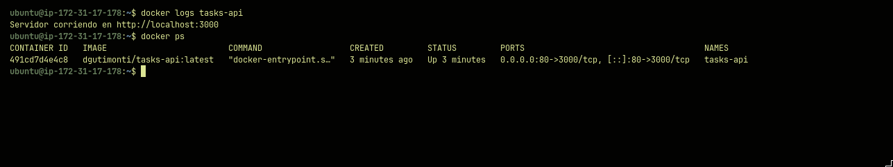
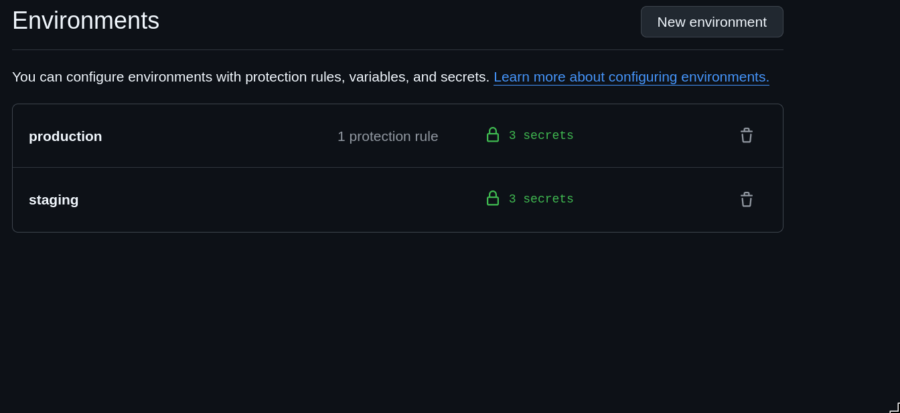

# Informe - Laboratorio 5.2: Pipeline de Despliegue Continuo con Docker

## 1. Descripción del Proyecto

**Tasks API** es una API REST para gestión de tareas construida con Node.js y Express, contenerizada con Docker y desplegada automáticamente en una instancia EC2 de AWS mediante un pipeline de CD configurado en GitHub Actions.

### Entidad: Task

| Campo       | Tipo    | Descripción                        |
|-------------|---------|------------------------------------|
| id          | number  | Identificador único (autogenerado) |
| title       | string  | Título de la tarea (obligatorio)   |
| description | string  | Descripción opcional               |
| completed   | boolean | Estado de completado               |
| createdAt   | string  | Fecha de creación (ISO 8601)       |

### Endpoints disponibles

| Método | Ruta             | Descripción              |
|--------|------------------|--------------------------|
| GET    | /health          | Estado de la API (version) |
| GET    | /api/tasks       | Listar todas las tareas  |
| GET    | /api/tasks/:id   | Obtener tarea por ID     |
| POST   | /api/tasks       | Crear nueva tarea        |
| PUT    | /api/tasks/:id   | Actualizar tarea         |
| DELETE | /api/tasks/:id   | Eliminar tarea           |

---

## 2. Descripción del Pipeline de CD

### Arquitectura general

```
Push a main
     ↓
GitHub Actions
     ↓
┌─────────────────────────────────────────┐
│  Job 1: build-and-push                  │
│  → Construye imagen Docker              │
│  → Sube a Docker Hub con dos tags:      │
│     - tasks-api:latest                  │
│     - tasks-api:<SHA_del_commit>        │
│  → Escanea vulnerabilidades con Trivy   │
└─────────────────────────────────────────┘
     ↓ (solo si Job 1 pasó)
┌─────────────────────────────────────────┐
│  Job 2: deploy-staging                  │
│  → Se conecta al EC2 por SSH            │
│  → Descarga la nueva imagen             │
│  → Levanta contenedor en puerto 3001    │
│  → Ejecuta health check                 │
│  → Si pasa: reemplaza contenedor activo │
│  → Si falla: mantiene versión anterior  │
└─────────────────────────────────────────┘
     ↓ (solo si Job 2 pasó)
┌─────────────────────────────────────────┐
│  Job 3: deploy-production               │
│  → Despliega versión con SHA exacto     │
│  → Contenedor expuesto en puerto 80     │
└─────────────────────────────────────────┘
```

### Decisiones técnicas tomadas

**Dockerfile multi-stage:**
Se utilizó un build de dos etapas para reducir el tamaño de la imagen final. La etapa `builder` instala todas las dependencias y copia el código. La etapa `runtime` solo copia lo estrictamente necesario para ejecutar la aplicación, descartando herramientas de compilación y archivos de desarrollo.

**Etiquetado doble de imágenes:**
Cada imagen se sube con dos tags:
- `latest`: para que el servidor siempre pueda descargar la versión más reciente fácilmente.
- `SHA del commit`: para poder identificar exactamente qué versión del código está corriendo y facilitar el rollback.

**Health check antes del reemplazo:**
El script de despliegue no reemplaza el contenedor activo hasta verificar que el nuevo responde correctamente en `/health`. Si el nuevo contenedor falla, el script cancela el despliegue y la versión anterior sigue funcionando en el puerto 80.

**Dos entornos separados (staging y production):**
Se configuraron dos entornos en GitHub para simular un flujo real de entrega. El código pasa primero por staging y solo llega a production si staging fue exitoso.

**Escaneo de vulnerabilidades con Trivy:**
Se integró Trivy en el pipeline para analizar la imagen Docker en busca de vulnerabilidades conocidas en el sistema operativo y las dependencias. El resultado se muestra como tabla en los logs de Actions.

---

## 3. Evidencias

### 3.1 Pipeline completo ejecutándose en Actions




---

### 3.2 Job build-and-push — Build y push a Docker Hub




---

### 3.3 Job build-and-push — Escaneo de vulnerabilidades con Trivy




---

### 3.4 Job deploy-staging — Health check exitoso




---

### 3.5 Job deploy-production — Despliegue completado




---

### 3.6 Imagen publicada en Docker Hub




---

### 3.7 API funcionando en la instancia EC2

> 📸 _Insertar captura del navegador accediendo a http://IP_EC2/health y mostrando la respuesta JSON con version 2.0.0_



---

### 3.8 Contenedor corriendo en EC2

> 📸 _Insertar captura del comando `docker ps` dentro del EC2 mostrando el contenedor activo_



---

### 3.9 Entornos configurados en GitHub

> 📸 _Insertar captura de Settings → Environments mostrando staging y production_



---

## 4. Cómo realizar un Rollback

Si después de un despliegue exitoso se descubre un bug crítico, se puede revertir a cualquier versión anterior usando el SHA del commit correspondiente.

**Paso 1 — Identificar el SHA de la versión anterior**

En GitHub, ve a la pestaña **Actions** y busca el último workflow exitoso antes del problema. El SHA aparece en el nombre del run o en los logs del job `build-and-push`.

También puedes verlo con:
```bash
git log --oneline
```

**Paso 2 — Conectarse al servidor**

```bash
ssh -i tu-llave.pem ubuntu@IP_DE_TU_EC2
```

**Paso 3 — Revertir al contenedor anterior**

```bash
# Reemplaza SHA_ANTERIOR por el SHA del commit que quieres restaurar
SHA_ANTERIOR="abc1234def5678..."

docker pull tuusuario/tasks-api:$SHA_ANTERIOR
docker stop tasks-api
docker rm tasks-api
docker run -d \
  --name tasks-api \
  --restart unless-stopped \
  -p 80:3000 \
  tuusuario/tasks-api:$SHA_ANTERIOR

echo "Rollback completado a versión $SHA_ANTERIOR"
```

**Paso 4 — Verificar**

```bash
curl http://localhost/health
docker ps
```

El rollback es posible gracias al etiquetado con SHA. Sin ese tag, solo existiría `latest` y sería imposible saber qué versión exacta está corriendo o recuperar una anterior.

---

## 5. Reflexión

### Ventajas de usar contenedores y CD en un proyecto real

**Reproducibilidad:** Docker garantiza que la aplicación corre exactamente igual en desarrollo, staging y producción. Elimina el problema clásico de "en mi máquina funciona".

**Despliegues sin downtime:** El health check del pipeline asegura que el contenedor nuevo está sano antes de reemplazar el anterior. Si algo falla, la versión anterior sigue respondiendo sin interrupción para los usuarios.

**Trazabilidad:** Cada imagen está etiquetada con el SHA del commit que la generó. Esto permite saber exactamente qué código está corriendo en producción y revertir a cualquier versión anterior en minutos.

**Velocidad de entrega:** Sin CD, desplegar requiere conectarse manualmente al servidor, descargar el código, reiniciar servicios y verificar que todo funciona. Con CD, todo eso ocurre automáticamente con cada push a main, reduciendo el tiempo de entrega de horas a minutos.

**Seguridad proactiva:** El escaneo de vulnerabilidades con Trivy detecta problemas conocidos en las dependencias antes de que lleguen a producción, permitiendo corregirlos temprano.

**Confianza en el equipo:** Cualquier desarrollador puede desplegar a producción siguiendo el mismo proceso estandarizado, sin depender de una persona específica que "sabe cómo deployar".

---

## Documentación del Laboratorio

Puedes encontrar el informe completo con capturas de pantalla y evidencias en este archivo.

- Repositorio: https://github.com/dgutimonticode/tasks-api
- API en producción: http://98.93.81.182/health
